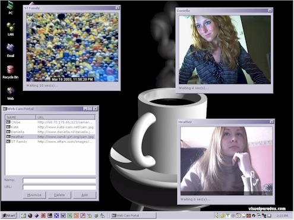

## Web Cam Portal

### Description

The other day I posted some code on how to download files from the web without the use of Winsock or API calls. I decided to take it a step further to actually make a project using that code to show how it can be used in an application. This post is a simple WebCamPortal type application. Just provide the interface with URL's to Web Cam images and you can open multiple web cam viewers and watch away.
 
### More Info
 

             |
---                |---
**Submitted On**   |2003-03-27 14:25:42
**By**             |[Chloe](https://github.com/Planet-Source-Code/PSCIndex/blob/master/ByAuthor/chloe.md)
**Level**          |Beginner
**User Rating**    |5.0 (60 globes from 12 users)
**Compatibility**  |VB 6\.0
**Category**       |[Complete Applications](https://github.com/Planet-Source-Code/PSCIndex/blob/master/ByCategory/complete-applications__1-27.md)
**World**          |[Visual Basic](https://github.com/Planet-Source-Code/PSCIndex/blob/master/ByWorld/visual-basic.md)
**Archive File**   |[Web\_Cam\_Po1565153272003\.zip](https://github.com/Planet-Source-Code/chloe-web-cam-portal__1-44296/archive/master.zip)

